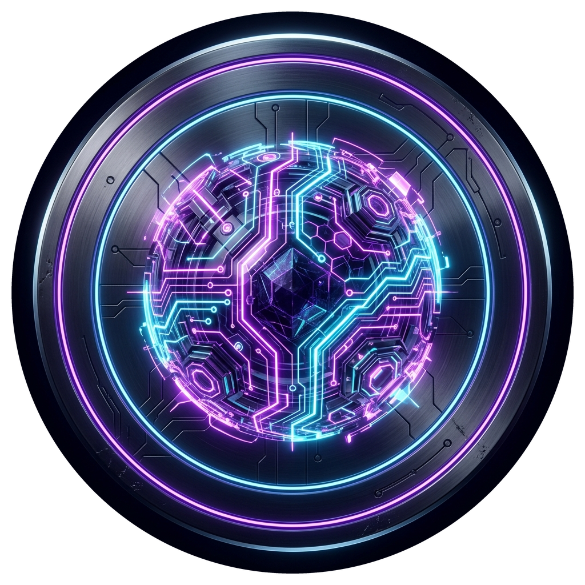
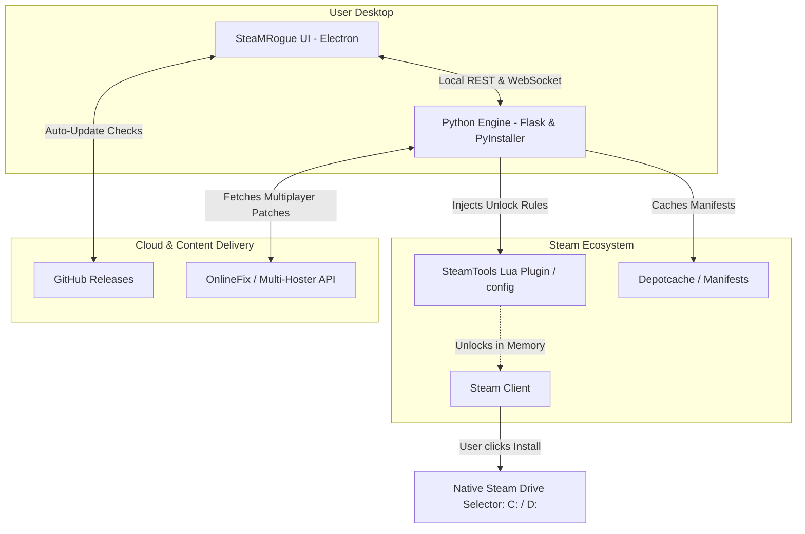

 

# ⚡ SteaMRogue
### *The Ultimate Next-Gen Steam Library, Game Unlocking & Multiplayer Patching Suite*

  <b>A modern, high-octane desktop application engineered to give you absolute control over your Steam gaming experience.</b> 
  Featuring native Steam drive selection, automated OnlineFix multiplayer patch injection, multi-host high-speed mirrors, and silent zero-friction auto-updates.

 

[-0078D4?style=for-the-badge&logo=windows)](https://github.com/mythoscd/SteaMRogue/releases)

 

  <a href="#-quick-download"><b>📥 Quick Download</b></a> •
  <a href="#-why-steamrogue"><b>🔥 Why SteaMRogue?</b></a> •
  <a href="#-key-features"><b>✨ Features</b></a> •
  <a href="#-how-it-works"><b>⚙️ Architecture</b></a> •
  <a href="#-user-guide"><b>📖 User Guide</b></a> •
  <a href="#-faq"><b>❓ FAQ</b></a>

---

 

## 🔥 Why SteaMRogue?

Legacy tools and manual methods are tedious, error-prone, and often corrupt your Steam installation folders. **SteaMRogue re-imagines the entire workflow from the ground up:**

| Feature / Capability | Traditional / Legacy Tools | ⚡ **SteaMRogue** |
| :--- | :---: | :---: |
| **Drive Destination Selection** | ❌ Hardcoded to `C:\` (causes *Disk Space Full* errors) | ✅ **Native Steam Drive Picker (`C:`, `D:`, NVMe SSD)** |
| **Multiplayer Patch Search** | ❌ Manual web surfing through pop-up ad link shorteners | ✅ **Instant In-App Search Engine with direct metadata** |
| **Download Pipeline** | ❌ Broken rate limits, slow captcha hosts | ✅ **High-speed Pixeldrain API, Gofile & FileDitch mirrors** |
| **Archive Extraction** | ❌ Manually find archive password, extract via 7-Zip | ✅ **1-Click Auto-Extraction with built-in password dictionary** |
| **Patch Installation** | ❌ Dragging and dropping files into nested game folders | ✅ **Direct 1-Click Injection straight into the game root** |
| **App Updates** | ❌ Manually check forums & re-download setup files | ✅ **Built-in Background Delta Updater with 1-click apply** |
| **User Interface** | ❌ Clunky CLI prompts or outdated Windows 98-style GUIs | ✅ **Gorgeous Cyberpunk Project Lightning Dark Neon UI** |
| **Antivirus Safety** | ❌ Silent file deletions caused by false positives | ✅ **Integrated Windows Defender Exclusion Assistant** |

 

---

## ✨ Key Features

### 🎯 1. Native Steam Library & Drive Selection
* **Zero Drive Locking:** SteaMRogue never forces a predetermined drive or creates dummy ACF state flags that trick Steam into thinking a game is "already installed on C:".
* **Steam's Official Dialog:** When you click **Install** in Steam, you get Steam's genuine installation prompt: choose **Windows 11 (C:)**, **Secondary Storage (D:)**, or an external drive with complete freedom.
* Full compatibility with standard Steam shortcut creation (Desktop and Start Menu checkboxes).

### 🌐 2. Automated OnlineFix Multiplayer Engine
* **Instant Matchmaking Patches:** Search for any multiplayer title and fetch community-verified OnlineFix fixes instantly.
* **Smart Multi-Hoster Resolver:**
  * ⚡ **Pixeldrain Direct API:** Ultra-fast, unrestricted downloads.
  * 🚀 **Gofile Token & Salt Engine:** Automated dynamic negotiation for seamless downloading without browser interaction.
  * 🛡️ **FileDitch & CDN Mirrors:** High-reliability fallback routes.
* **Auto-Extract & Inject:** Automatically decrypts archives using standard passphrases (`online-fix.me`), injects game-specific DLLs, and cleans up temporary archives.

### 🚀 3. Silent Zero-Friction Auto-Updates
* SteaMRogue includes a built-in update daemon connected directly to **GitHub Releases**.
* When a new build is released, a sleek notification card slides in at the bottom-right corner.
* Updates download in the background without interrupting your gaming session.
* Click **"Restart & Update"** to apply the new version in under 3 seconds!

### 🛡️ 4. Antivirus & Defender Helper
* Game-hooking DLLs (SteamTools / SmokeAPI / OnlineFix) often trigger heuristic *False-Positive* alarms in security suites.
* SteaMRogue features a dedicated 1-click **"Add Exclusion"** tool to easily whitelist your Steam installation directory in Windows Defender.

### 🎨 5. Project Lightning Dark Neon Interface
* Fluid responsive interface styled with a deep space violet and neon purple aesthetic.
* Rich grid views featuring high-resolution cover banners, search filters, and real-time download progress rings.

 

---

## ⚙️ How It Works

 

---

## 📥 Quick Download

Ready to get started? Download the latest single-file setup executable below:

[-7c3aed?style=for-the-badge&logo=windows&logoColor=white)](https://github.com/mythoscd/SteaMRogue/releases/latest)

*Compatible with Windows 10 & 11 (64-bit). Portable and installer builds available in [Releases](https://github.com/mythoscd/SteaMRogue/releases).*

 

---

## 📖 User Guide

### 🎮 Adding a Game to Steam
1. Open **SteaMRogue**.
2. Type the game name or Steam AppID into the search bar.
3. Select your game and click **"Add to Library"**.
4. Once completed, restart your Steam Client.
5. In your Steam library, click the blue **"INSTALL"** button on the game.
6. Choose your desired drive (**C:**, **D:**, etc.) in Steam's native prompt and let Steam download the files!

### 🌐 Applying Multiplayer Patches (OnlineFix)
1. Navigate to the **"OnlineFix"** tab inside SteaMRogue.
2. Search for the title you wish to play online.
3. Click **"Download Patch"** and select **"Integrate into Game"**.
4. SteaMRogue will download the patch, automatically unpack it with the password, and copy files directly into your game's directory.
5. Launch the game from Steam and invite your friends!

 

---

## ❓ Frequently Asked Questions (FAQ)

<b>1. Can I choose which drive or folder to install games on?</b>

 
<b>Absolutely yes!</b> Unlike older tools that locked games into <code>C:\Program Files (x86)\Steam</code>, SteaMRogue leaves the drive allocation entirely to Steam's official installation prompt. You can choose any library drive configured on your PC.

<b>2. How do updates work for other players/users?</b>

 
Completely hands-free. Because SteaMRogue has a built-in background update engine, every time you or your friends launch the app, it checks GitHub. If an update exists, it automatically downloads and prompts with a <i>"Restart & Update"</i> button. Nobody needs to download manual files from a browser ever again.

<b>3. Why does my Antivirus trigger when installing patches?</b>

 
Multiplayer fixes and SteamTools use memory hooking (similar to mod loaders and injectors) to enable multiplayer routing via Steam Spacewar (AppID 480). Antivirus programs often flag these as <i>"Riskware"</i> or <i>"HackTool"</i>. This is a standard false positive. Simply use the <b>"Add Exclusion"</b> button in SteaMRogue to whitelist your Steam directory.

<b>4. Do I need to manually extract archives or enter passwords?</b>

 
No! SteaMRogue has a built-in extraction engine that tests common dictionary passwords (e.g. <code>online-fix.me</code>) and extracts files automatically into your game root.

 

---

## 💻 System Requirements

| Specification | Minimum | Recommended |
| :--- | :--- | :--- |
| **Operating System** | Windows 10 64-bit (Build 19041+) | Windows 11 64-bit (Latest) |
| **Processor** | Dual-Core 2.0 GHz Intel / AMD | Quad-Core 2.5 GHz or higher |
| **System Memory (RAM)** | 2 GB RAM | 4 GB RAM or higher |
| **Storage** | 300 MB for SteaMRogue | NVMe / SSD Storage |
| **Steam** | Official Steam Client installed | Official Steam Client installed |

 

---

## 📜 Legal & Educational Disclaimer

> [!IMPORTANT]
> **SteaMRogue** is an independent open-source utility developed for personal library organization, modding, and educational research purposes. SteaMRogue is **not affiliated with, endorsed by, or associated with Valve Corporation, Steam, or OnlineFix**. All trademarks, game titles, logos, and digital assets belong to their respective copyright holders. Users are encouraged to support game developers by purchasing original copies of games they enjoy.

 

---

### ⭐ Enjoying SteaMRogue? Give it a Star!
If SteaMRogue made your gaming life easier, please consider starring the repository to help other gamers discover it!

 

Maintained with ❤️ by **[@mythoscd](https://github.com/mythoscd)**  
*SteaMRogue Project • 2026*

